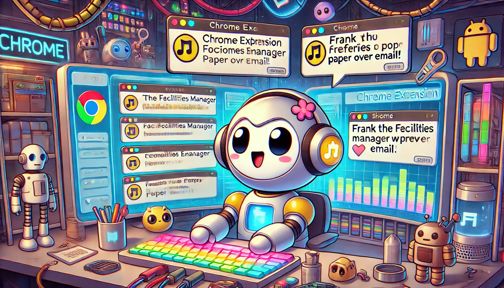

<p align="center">
  
</p>

# TeamMessenger Chrome Extension

## Overview

**TeamMessenger** is a Chrome extension designed to display organization-wide messages from an admin to users, with a unique AI-enhanced chat feature. This AI chat is powered by OpenAI’s GPT, and the personalities of message senders are reflected in the interactions. For example, _Frank the Facilities Manager_ prefers paper over technology, and the AI will respond in character based on this personality.

### Key Features:

- **UI**: Built using **React**, **Tailwind CSS**, and **CSS Modules**.
- **Sound Alerts**: Plays a sound for high-priority unread messages.
- **Badge Notifications**: The extension displays a badge when there are unread high-priority messages.
- **Local Storage**: Uses `chrome.storage` for message storage, with a fallback to `localStorage` for development.
- **AI-Driven Chat**: Powered by GPT, the chat responses reflect the personality of message senders, as described in `messages.json`.

### Personality-Driven AI

The message sender's personality is imbued in the GPT-powered AI chat, as illustrated by the data in `messages.json`:

```json
{
  "id": "msg010",
  "name": "Frank",
  "role": "Facilities Manager",
  "personality": "Handy with tools but avoids technology like the plague.",
  "background": "Keeps the office building in shape but doesn't understand computers.",
  "title": "Email on Paper",
  "content": "Can you print all my emails? I'd rather read them on paper.",
  "priority": "low",
  "timestamp": "2024-10-13T13:00:00Z",
  "read": false
}
```

This data ensures the AI stays in character, providing engaging interactions.

## Getting Started

### 1. Prerequisites

- **Node.js**: Ensure you have Node.js installed.
- **npm**: Project uses npm for package management.
- **Vite**: Build tool for the development environment.
- **OpenAI GPT API Key**: To enable AI chat functionality, you'll need an OpenAI API key. You can obtain one by signing up at [OpenAI&#39;s website](https://platform.openai.com/apps).

Add your API key to a `.env` file:

```bash
VITE_OPENAI_API_KEY=<your_api_key_here>
```

### 2. Installation

1. Clone the repository:
   ```bash
   git clone https://github.com/Indicaza/TeamMessenger.git
   cd TeamMessenger
   ```
2. Install dependencies:
   ```bash
   npm install
   ```

### 3. Running in Development Mode

To start the development server, run:

```bash
npm run dev
```

This will open the app in your browser at `http://localhost:5173`. In development. Running "npm run dev" will serve the app from `index.html` for development. This project is responsive, but if you want to mirror the Chrome extension set the dimensions to 500x500 in the dev tools.

### 4. Building for Production

To build the extension:

```bash
npm run build
```

- The output will be in the `dist/` directory.
- It automatically adjusts paths for Chrome extension compatibility.

### 5. Uploading to Chrome as an Extension

To use the app as a Chrome extension:

1. Navigate to `chrome://extensions`.
2. Enable "Developer mode."
3. Click "Load unpacked" and select the `dist/` folder.

### 6. Directory Structure

Key parts of the directory:

- **public/**:

  - `manifest.json`: Defines the Chrome extension.
  - `popup.html`: The interface users interact with when they click the extension icon.
  - `offscreen.html`: Used for handling audio notifications.

- **src/**:

  - **components/**: Reusable React components like `ChatWindow`, `Sidebar`, and `Navbar`.
  - **assets/**: Contains icons, sounds, and message data.
  - **background.js**: Handles background tasks like message polling.
  - **offscreen.js**: Manages sound alerts for high-priority messages.
  - **main.jsx**: The entry point for the extension’s UI.

- **tests/**:

  - Contains unit tests for components and hooks.

### 7. Key Features Recap

- **AI-Powered Messages**: GPT-driven chat with tailored personalities.
- **Badge and Sound Alerts**: Notify users of unread high-priority messages.
- **Chrome Storage**: Uses `chrome.storage` with a fallback to `localStorage`.
- **React + Tailwind CSS**: Modern, responsive design using CSS Modules and Tailwind.

### 8. CI/CD

CircleCI is used for continuous integration and deployment. The CI/CD pipeline includes:

- Installing dependencies.
- Running tests in parallel.
- Building the project and compressing it for deployment.

Check the `.circleci/config.yml` file for details.
